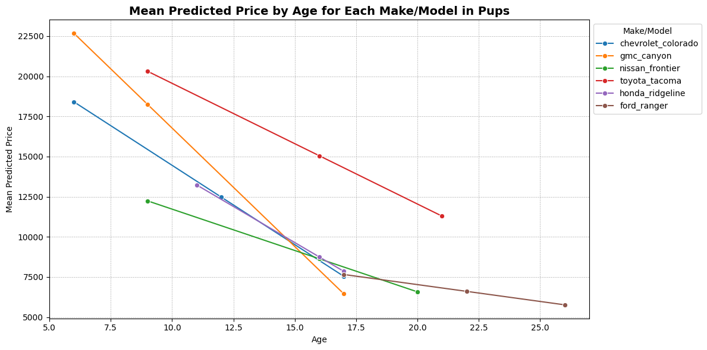
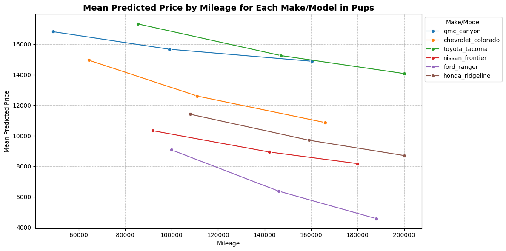
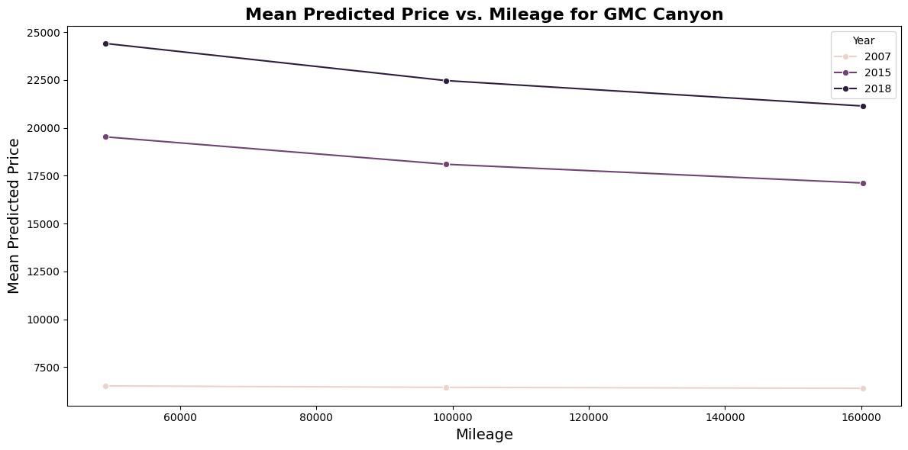
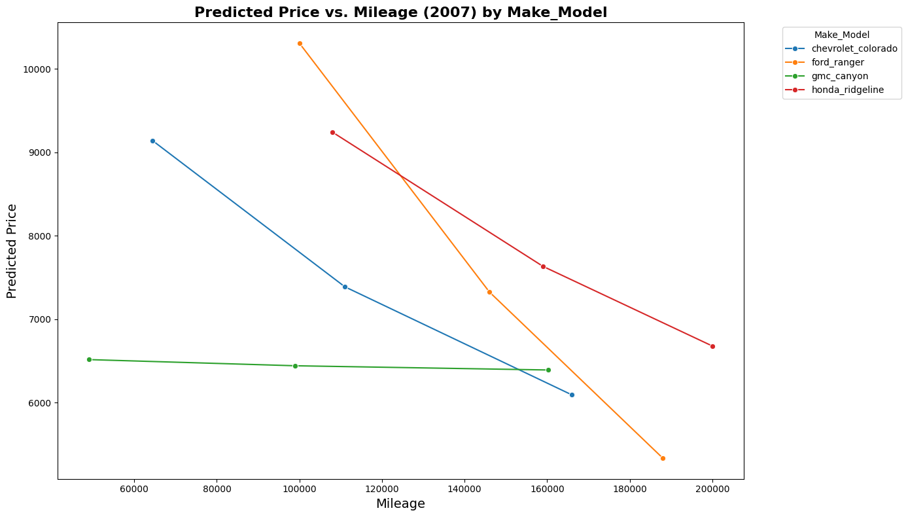

# MSBA_analyzing_many_models  

Assignment from applied analytics course.  
  
## Comparing Compact Pickup Trucks  
This analysis focused on compact pickup trucks, vehicles often purchased for utility and simplicity. The models considered in this dataset were the Toyota Tacoma, GMC Canyon, Honda Ridgeline, Chevrolet Colorado, and Ford Ranger. Only iterations of these models with non-extended cabs were considered as an extended cab on a compact pickup diminishes simplicity more than it increases utility. Comparing predicted prices for these models suggests that the Tacoma can be expected to demand the highest asking price across the board. The Canyon also shows a high asking price in recent years, but older models are much less valuable. Other models in the class display similar predicted prices, though the Ford Ranger appears to hold value the least well overall. 
  
## Toyota Tacomas Are Value Leaders in Class  
  
Comparing predicted price by age of vehicle suggests that the Toyota Tacoma holds value significantly more than its class-counterparts. Newer builds of the GMC Canyon also hold value, but older models display a steep drop-off in expected value. The Cheverolet Colorado and Honda Ridgeline show similar valuation in respects to age, while the Nissan Frontier and Ford Ranger show the lowest expected values in the class. With the exception of the Tacoma, all vehicles in this class apppear to have relatively similar expected values prior to 2008-09.  
  
## Three-ish Value Tiers by Mileage  
  
Examining predicted price by mileage again shows the Tacoma as value leader, though the Canyon also does well. The Colorado, Ridgeline, and Frontier hold steady in the middle of the pack, and the Ranger again displays the lowest expected value.  
  
## 2007 Appears to Have Been a Bad Year For the GMC Canyon  
  
Examining predicted price by year for most models shows expected trends, with price decreasing at regular intervals as age and mileage increase. One notable exception is the Canyon, which follows expected trends for later models, but has a resolutely low valuation across the board for vehicles built in 2007.  
  
## Speaking of 2007...  
  
2007 is notable for the curious expected value of the GMC Canyon and also a surprisingly high expected value for the Ford Ranger. Rangers display the lowest expected value in the class generally, but show a surprisingly high valuation for models with low mileage in this year.  